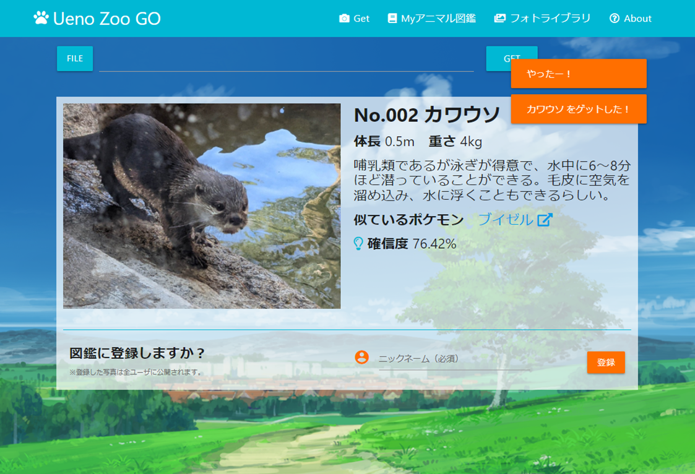
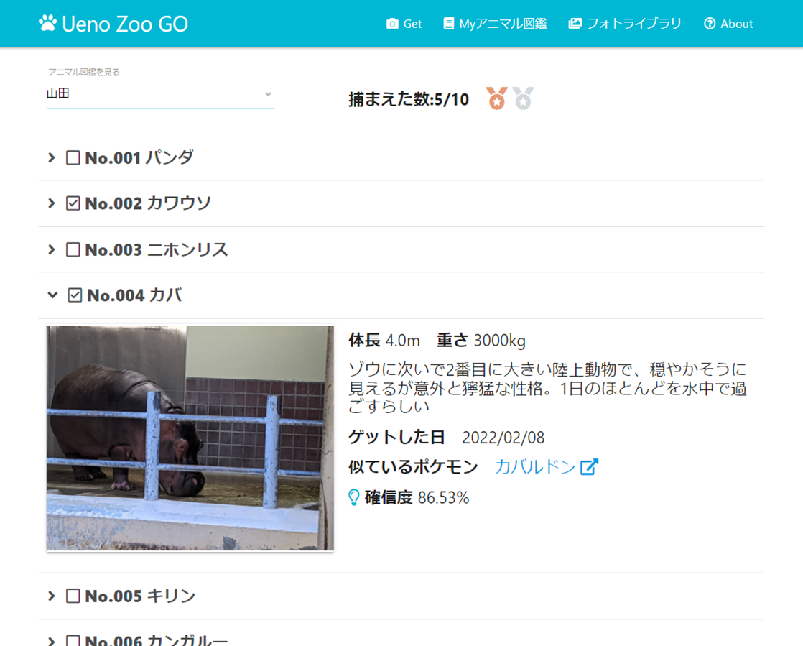
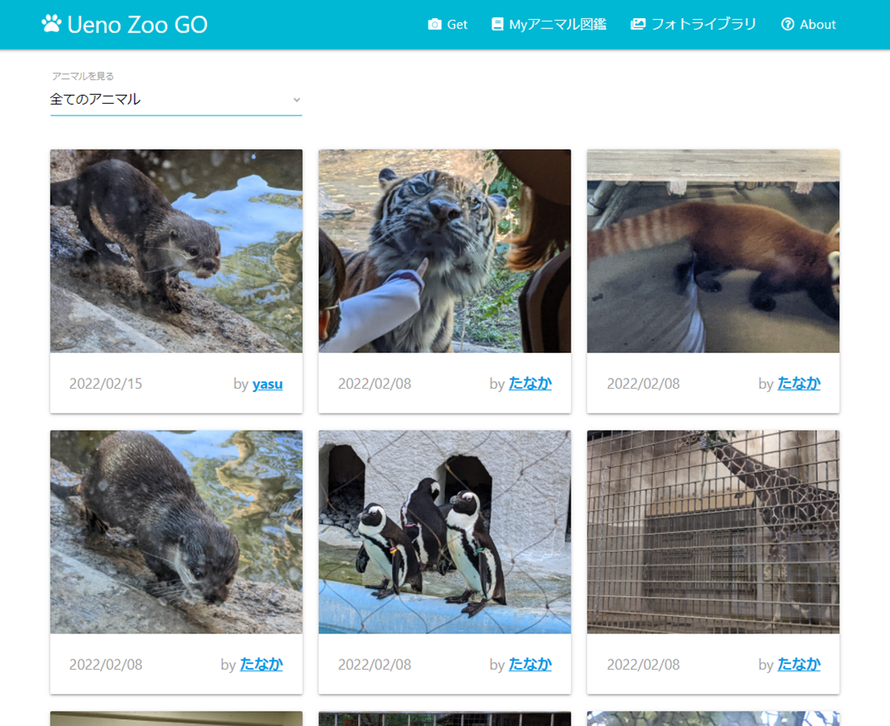
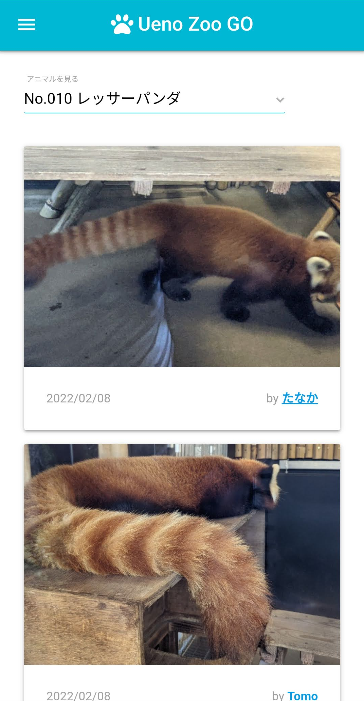
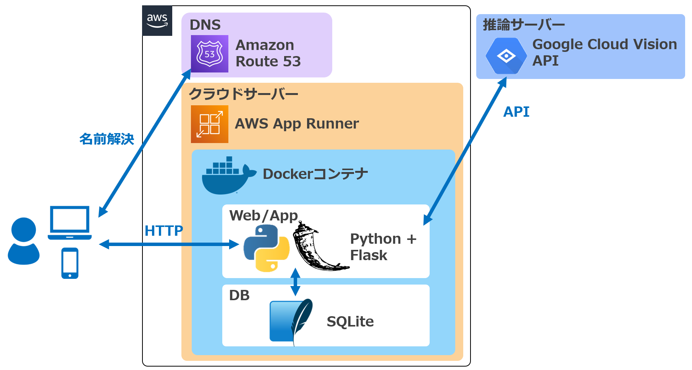

# Ueno Zoo Go
動物の写真をアップロードすると、その名前・特徴と似ているポケモンを知ることができるWebサイトです。

自分だけのMyアニマル図鑑を作ったり、他の人が図鑑に登録した好きな動物の写真を見ることができます。
＜Myアニマル図鑑＞

＜フォトライブラリ＞ 他の人が図鑑に登録した写真を見ることができます。

レスポンシブ対応のため、スマホ/PCどちらからでも利用可能です。

 

## サイトURL
https://www.ueno-zoo-go.tk/
 

## 構成図
 

## 主な使用技術
### アプリケーション
- Python 3.7
  - Flask (Webフレームワーク)
  - SQLAlchemy (ORM)
  - Opencv (画像処理)
- UI周り
  - Materialize (フロントエンドフレームワーク)
  - JQuery (Javascriptライブラリ)
  - SweetAlert2(ダイアログ表示)
  - Font Awesome (アイコン)
  - Google Acon Font (アイコン)

### インフラ
- AWS App Runner
- Amazon ECR
- Amazon Route 53
- freenom
- Docker / docker-compose
- SQLite

### API
- Google Cloud Vision API
 

## 機能一覧
- 動物をGETする機能
  - 画像アップロード
  - 画像からの動物推定
  - Myアニマル図鑑への登録
- Myアニマル図鑑を表示する機能
- フォトライブラリを表示する機能
  - すべてのアニマルを表示 / 指定したアニマルのみ表示
  - ページネーション
 

## 工夫したこと
- ゲーミフィケーションの要素を取り入れ、動物の写真を撮るのが楽しくなるような作りとした
  - 例）動物をうまく撮影できたらゲットできる（図鑑に登録できる）、図鑑に登録した数に応じてメダルを表示する、など
  - 実際に上野動物園に行って使ってみましたが、一つずつ図鑑が埋まっていくのが楽しかったです
- アイコンを多めにする、ローディング中のアイコンを表示するなど、なるべくわかりやすいUIとした
- 画像認識AIとして外部のAPIを利用することで、自身でデータ収集・AIモデル作成・学習や推論サーバー構築等を行うことなく、動物の画像認識を行うことを可能とした

## 今後の課題
- 一旦、画像の保存先・DBはコンテナ内とした。これらは当然コンテナ外に置いて永続化すべきなので、AWS Fargate + EFS + RDSのような構成でデータを永続化することを今後の課題としたい。